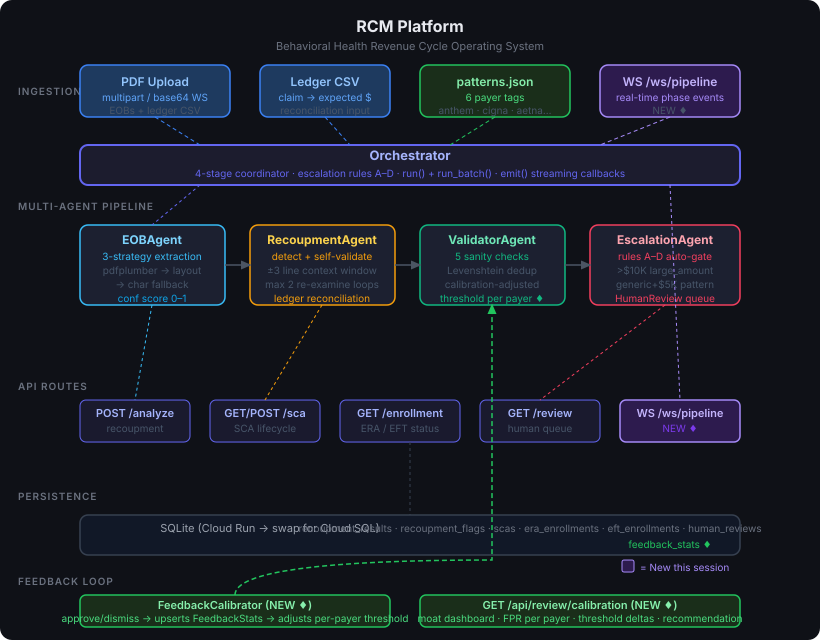

# TexMed — Behavioral Health RCM Platform

> **A purpose-built operating system for behavioral health billing teams — replacing ad-hoc coordination tools with structured workflows.**



A multi-agent AI platform that catches hidden payer clawbacks, tracks Single Case Agreement lifecycles, and manages ERA/EFT enrollment status — built for behavioral health practices that can't afford to miss a $18,000 offset buried in an EOB.

**Live demo:** https://texmed-platform-hagfyuumxa-uc.a.run.app  
**API docs:** https://texmed-platform-hagfyuumxa-uc.a.run.app/docs

---

## The problem

Payers like Anthem hide recoupments as line-item offsets inside EOBs. A billing coordinator processes the EOB, the check arrives, everything looks fine — then 3 months later a collection letter arrives for money the payer already took back. The Haddad case that inspired this: **$18,020.11**, missed for 90 days, hidden in 4 lines on page 3.

Beyond recoupments, behavioral health practices lose money three other ways this platform addresses:
- **Expired SCAs** — billing under a dead Single Case Agreement means retroactive denials
- **Lapsed ERA enrollment** — paper EOBs mean manual reconciliation and 30+ day delays
- **Missed EFT re-enrollment** — bank switches cause weeks of paper check processing

---

## What's built

### Multi-agent pipeline

```
PDF Upload
    ↓
EOBAgent          — 3-strategy iterative extraction (pdfplumber standard → layout → char fallback)
    ↓                 confidence scoring 0–1, escalates if < 0.4
RecoupmentAgent   — pattern detection against 6 payer phrase libraries + ledger reconciliation
    ↓                 Moss semantic recall on every line regex missed (<10ms, in-process)
    ↓                 self-validation loop: re-examines ±3 line window, max 2 iterations
ValidatorAgent    — 5 sanity checks, Levenshtein duplicate detection
    ↓                 thresholds dynamically adjusted per payer via feedback calibration
EscalationAgent   — 4 auto-escalation rules, writes HumanReview tickets
    ↓
Result: APPROVED / ESCALATED / REJECTED
```

### API surface

| Route | What it does |
|-------|-------------|
| `POST /api/recoupment/analyze` | Analyze a single EOB PDF |
| `POST /api/recoupment/batch` | Batch analyze multiple EOBs |
| `GET  /api/recoupment/history` | Past results |
| `WS   /ws/pipeline` | Real-time streaming — phase events per file as agents run |
| `GET  /api/sca/` | All SCAs with computed status |
| `POST /api/sca/create` | Create a new SCA |
| `GET  /api/sca/alerts` | SCAs expiring or exhausted |
| `GET  /api/enrollment/era` | ERA enrollment status per payer |
| `GET  /api/enrollment/eft` | EFT enrollment status per payer |
| `GET  /api/review/pending` | Human review queue |
| `POST /api/review/{id}/approve` | Approve a ticket (triggers calibration) |
| `POST /api/review/{id}/dismiss` | Dismiss a ticket (triggers calibration) |
| `GET  /api/review/calibration` | Moat dashboard — per-payer FPR and threshold adjustments |
| `GET  /api/semantic/stats` | Moss retrieval telemetry — readiness, latency p50/p95, learned phrases |

### Moss semantic recall — catching rewordings the pattern library has never seen

`patterns.json` is a regex library. It only ever catches phrasings somebody
already wrote down. When a payer rewords an offset, nothing fires and the
clawback is missed silently — which is the exact 90-day failure mode this
platform exists to prevent.

That gap is measurable. `platform/eval_semantic.py` runs a **held-out** set of 45
EOB lines (20 reworded clawbacks, 25 benign) — none of which appear in the
indexed corpus, so it scores generalisation rather than memorisation:

```
baseline (regex only)   precision=1.000  recall=0.200  f1=0.333   TP=4  FP=0  FN=16  TN=25
```

**The regex library catches 4 of 20 reworded clawbacks. It misses 80%.**

[Moss](https://moss.dev) closes that gap. Every line regex rejects is queried
against a labeled phrase corpus (`platform/recoupment_corpus.json`):

```
line → regex miss → Moss query → nearest neighbour is a clawback phrase? → flag
```

Classification is **nearest-neighbour, not a bare similarity threshold**. The
corpus holds 40 `recoupment` phrasings *and* 30 `benign` ones (contractual
adjustment, patient responsibility, sequestration). A line flags only when its
top hit is a recoupment doc above threshold. The benign half is load-bearing:
it is what stops ordinary adjustment lines from firing. Recall bought with
precision is not a win — a coordinator who gets 40 false flags per EOB stops
reading them.

**Why Moss and not a vector database.** This runs per-line × per-file ×
per-batch on the WebSocket hot path that streams agent progress to the
dashboard. One 300-line EOB is ~300 queries; a 20-file batch is thousands. At a
hosted vector DB's 50–200ms round-trip that is minutes of added latency and the
live pipeline view stops being live. Moss runs search in-process after
`load_index`, so retrieval stays in single digit milliseconds and drops out of
the latency budget. A money-gate pre-filter skips lines with no dollar figure,
cutting query volume further — a clawback the practice can act on always states
an amount.

**Why Moss and not a hosted embedding API — PHI.** Per the Moss SDK, `query()`
runs entirely in-memory with no network round-trip once the index is loaded.
Only the payer-phrase corpus is ever sent to the cloud, and it contains no
patient data. EOB line text — which *is* PHI — never leaves the process. A
hosted embedding endpoint would put PHI on the wire for every line of every EOB.

**The learning loop.** When a billing coordinator approves a review ticket, the
confirmed line is added to the index (`EscalationAgent._teach_semantic_layer`).
This is the retrieval counterpart to the calibration table below: dismissals
tighten thresholds, approvals widen what the system can recognise. One
coordinator confirming an Anthem rewording means the next EOB carrying that
phrasing — from any payer — is caught on the first pass.

**Degradation is total.** No credentials, missing package, Python < 3.10, index
failure, query timeout — every path disables the layer and leaves the regex
pipeline byte-for-byte unchanged. `GET /api/semantic/stats` reports readiness,
query volume, p50/p95 latency, and why it is off if it is.

#### Setup

Moss requires **Python 3.10+** (the layer self-disables on 3.9).

```bash
cd platform
cp .env.example .env     # then add your credentials from https://moss.dev
pip install -r requirements.txt
```

#### Seeing it work

```bash
python make_sample3.py                      # EOB with an offset worded in unseen language
cd platform
python run_pipeline.py ../samples/regional_reworded_sample.pdf
```

Regex-only returns `APPROVED | flags=0` and reports the full $9,480.00 as
received. With Moss enabled the reworded line is flagged and `net_received`
drops to $6,240.00 — the amount the practice will actually bank.

```bash
python eval_semantic.py                     # precision/recall/latency, both configs
python eval_semantic.py --threshold 0.5     # tune the operating point
python -m pytest tests/test_semantic_matcher.py -v
```

> **Status note.** The regex baseline above is measured. The integration is
> covered by 16 tests that run against the real Moss SDK types with a stubbed
> transport, so they verify wiring — index build, query dispatch, classification,
> flag construction, the learning loop, degradation — but not retrieval quality.
> The with-Moss precision/recall row is produced by running `eval_semantic.py`
> with live credentials; it is deliberately not quoted here until measured.
> `MOSS_SCORE_THRESHOLD` will want tuning against real score distributions.

### The moat: feedback calibration loop

Every human approve/dismiss decision upserts `feedback_stats`:

```
Billing coordinator dismisses a false positive for "generic" payer
    → FeedbackCalibrator.record_outcome()
        → false_positive_rate for "generic" rises to 0.73
            → confidence_adjustment = +0.20

Next ValidatorAgent run for a "generic" payer flag:
    → effective_threshold = clamp(0.3, 0.9, 0.5 + 0.20) = 0.70
        → fewer false positives escalated
```

After 100 tickets, false positive rate drops measurably per payer. That calibration table is the data moat — competitors can copy the code, not the decisions.

---

## Project structure

```
texmed-platform/
├── patterns.json                    # payer-specific recoupment phrase library
├── make_sample3.py                  # generates the reworded-offset demo EOB
├── detector.py                      # standalone CLI tool (original prototype)
├── app.py                           # Flask demo (original prototype)
│
└── platform/                        # production FastAPI platform
    ├── main.py                      # FastAPI app, route registration
    ├── requirements.txt
    ├── Dockerfile
    ├── deploy.sh                    # one-command Cloud Run deploy
    │
    ├── agents/
    │   ├── orchestrator.py          # 4-stage coordinator, emit() streaming callbacks
    │   ├── semantic_matcher.py      # Moss retrieval layer (optional, self-disabling)
    │   ├── eob_agent.py             # iterative PDF extraction
    │   ├── recoupment_agent.py      # detection + self-validation loop
    │   ├── validator_agent.py       # cross-validation, calibration-adjusted thresholds
    │   └── escalation_agent.py     # human-in-the-loop gate, feedback recording
    │
    ├── api/
    │   ├── models/
    │   │   ├── base.py              # SQLAlchemy setup, SQLite
    │   │   ├── recoupment.py        # RecoupmentResult, RecoupmentFlag
    │   │   ├── sca.py               # SCA with status/warning computed properties
    │   │   ├── enrollment.py        # ERAEnrollment, EFTEnrollment
    │   │   ├── human_review.py      # HumanReview ticket queue
    │   │   └── feedback_stats.py    # per-payer FPR tracking (the moat)
    │   │
    │   ├── routes/
    │   │   ├── recoupment.py        # /api/recoupment/*
    │   │   ├── sca.py               # /api/sca/*
    │   │   ├── enrollment.py        # /api/enrollment/*
    │   │   ├── review.py            # /api/review/*
    │   │   └── ws_pipeline.py       # /ws/pipeline (WebSocket)
    │   │
    │   └── services/
    │       ├── recoupment_service.py
    │       ├── sca_service.py
    │       ├── enrollment_service.py
    │       └── feedback_calibrator.py   # threshold adjustment computation
    │
    ├── frontend/
    │   └── index.html               # single-page dashboard (no build step)
    │
    └── run_pipeline.py              # CLI runner for local testing
```

---

## Running locally

**Prerequisites:** Python 3.9+, pip. Use **Python 3.10+** for Moss semantic recall
(on 3.9 everything runs, minus that layer).

```bash
cd platform
pip install -r requirements.txt
uvicorn main:app --reload --port 8000
```

Open http://localhost:8000 — the full dashboard loads.

**Run the multi-agent pipeline from the CLI:**

```bash
cd platform
python run_pipeline.py path/to/eob.pdf
python run_pipeline.py path/to/eob.pdf --ledger claims_ledger.csv

# batch
python run_pipeline.py eob1.pdf eob2.pdf eob3.pdf

# human review queue
python run_pipeline.py --review
python run_pipeline.py --approve 3 "Verified clawback, amount matches ledger"
python run_pipeline.py --dismiss 4 "False positive — line item is a credit"
```

**Test WebSocket streaming:**

```bash
pip install websockets
python test_ws.py   # requires server running on :8000
```

---

## Deploying to Google Cloud Run

Requires `gcloud` CLI authenticated to a project with Cloud Run and Cloud Build APIs enabled.

```bash
cd platform
bash deploy.sh
```

This builds the image via Cloud Build (no local Docker needed), deploys to `us-central1`, and prints the live URL. Takes ~90 seconds.

To change the project or region, edit the variables at the top of `deploy.sh`:

```bash
PROJECT_ID="your-gcp-project"
REGION="us-central1"
SERVICE_NAME="texmed-platform"
```

> **Note on persistence:** Cloud Run uses SQLite on ephemeral disk. Data resets on container restarts. For a persistent production deployment, set `DATABASE_URL` to a Cloud SQL (Postgres) connection string.

---

## Adding payer patterns

`patterns.json` is the phrase library. Each key is a payer tag; each value is a list of regex patterns.

```json
{
  "anthem": [
    "outstanding\\s+neg\\s*bal\\s+with\\s+differ",
    "offset\\s+applied"
  ],
  "cigna": [
    "recovery\\s+amount",
    "prior\\s+overpayment"
  ],
  "generic": [
    "recoup",
    "clawback",
    "offset"
  ]
}
```

When the system escalates a ticket with `ticket_type = "new_payer_pattern"`, that's a signal to add the matched phrase to this file. The moat grows with every new payer encounter.

---

## Origin

Built from operational data and real failure modes observed running a behavioral health billing team. Every feature traces to a specific recurring problem:

- Recoupment detector → Anthem/Haddad $18,020.11 offset, missed 90 days
- SCA tracker → Cigna SCA expiry not noticed, 8 claims denied retroactively  
- ERA/EFT tracker → bank switch caused 60-day payment delay across 12 payers
- Human review queue → billing coordinator needed to verify before acting on AI flags
- Feedback calibration → after 3 false positives on generic patterns, thresholds tightened

---

## Stack

- **Backend:** FastAPI, SQLAlchemy, SQLite (swap to Postgres for production)
- **PDF parsing:** pdfplumber (3 strategies: standard, layout, character-level)
- **AI agents:** Pure Python — no LLM API calls, all rule-based with confidence scoring
- **Semantic retrieval:** [Moss](https://moss.dev) — in-process, sub-10ms, no vector DB, PHI stays local
- **WebSocket:** FastAPI native WebSocket + asyncio.Queue for sync→async bridge
- **Frontend:** Vanilla HTML/JS/CSS, no build step, no framework
- **Deploy:** Google Cloud Run via Cloud Build
